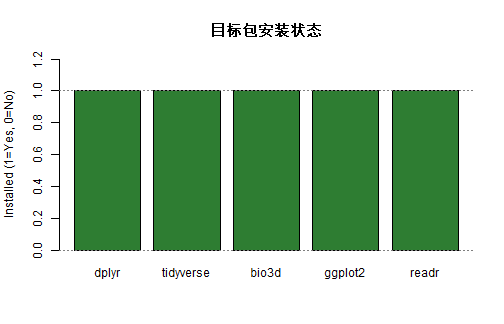
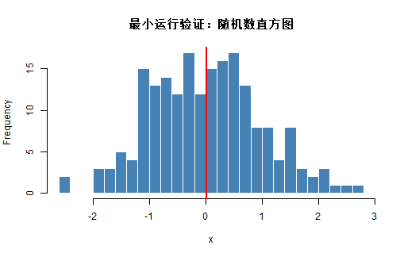

# 学习目标

- 正确安装 R 和 VS Code  
- 完成 VS Code 中的 R 开发环境配置  
- 配置 CRAN 镜像并管理常用包  
- 掌握常见安装报错的排查方法  

# 1. 环境总览

本课程使用的开发组合是：**R + VS Code + R 扩展**。

推荐安装顺序：

1. 安装 R（先保证 `R` 和 `Rscript` 可执行）
2. 安装 VS Code
3. 安装 VS Code 扩展：`R`、`R Debugger`（可选 `Code Runner`）
4. 配置镜像并安装常用包

# 2. 安装后的第一步检查

先确认当前 R 会话工作正常：


``` r
R.version.string
```

```
## [1] "R version 4.5.2 (2025-10-31 ucrt)"
```

``` r
sessionInfo()
```

```
## R version 4.5.2 (2025-10-31 ucrt)
## Platform: x86_64-w64-mingw32/x64
## Running under: Windows 10 x64 (build 19045)
## 
## Matrix products: default
##   LAPACK version 3.12.1
## 
## locale:
## [1] LC_COLLATE=Chinese (Simplified)_China.utf8 
## [2] LC_CTYPE=Chinese (Simplified)_China.utf8   
## [3] LC_MONETARY=Chinese (Simplified)_China.utf8
## [4] LC_NUMERIC=C                               
## [5] LC_TIME=Chinese (Simplified)_China.utf8    
## 
## time zone: Asia/Shanghai
## tzcode source: internal
## 
## attached base packages:
## [1] stats     graphics  grDevices utils     datasets  methods   base     
## 
## loaded via a namespace (and not attached):
## [1] compiler_4.5.2 cli_3.6.5      tools_4.5.2    knitr_1.51     xfun_0.57     
## [6] rlang_1.1.7    evaluate_1.0.5
```

再确认路径信息：


``` r
cat("R HOME:", R.home(), "\n")
```

```
## R HOME: C:/PROGRA~1/R/R-45~1.2
```

``` r
cat("Rscript path:", Sys.which("Rscript"), "\n")
```

```
## Rscript path: C:\PROGRA~1\R\R-45~1.2\bin\x64\Rscript.exe
```

``` r
cat("Library paths:\n")
```

```
## Library paths:
```

``` r
print(.libPaths())
```

```
## [1] "C:/Users/27743/AppData/Local/R/win-library/4.5"
## [2] "C:/Program Files/R/R-4.5.2/library"
```

解释：

- `R.home()` 用于定位 R 安装位置
- `Sys.which("Rscript")` 用于检查命令行能否找到 `Rscript`
- `.libPaths()` 用于检查包安装目录

# 3. CRAN 镜像与包安装

建议统一镜像，避免不同机器安装源不一致。


``` r
options(repos = c(CRAN = "https://cloud.r-project.org"))
getOption("repos")
```

```
##                          CRAN 
## "https://cloud.r-project.org"
```

检查目标包安装状态：


``` r
target_pkgs <- c("dplyr", "tidyverse", "bio3d", "ggplot2", "readr")
installed <- target_pkgs %in% rownames(installed.packages())
pkg_status <- data.frame(
  package = target_pkgs,
  installed = installed
)
pkg_status
```

```
##     package installed
## 1     dplyr      TRUE
## 2 tidyverse      TRUE
## 3     bio3d      TRUE
## 4   ggplot2      TRUE
## 5     readr      TRUE
```

可视化安装状态（1=已安装，0=未安装）：


``` r
barplot(
  height = as.numeric(pkg_status$installed),
  names.arg = pkg_status$package,
  col = ifelse(pkg_status$installed, "#2E7D32", "#C62828"),
  ylim = c(0, 1.2),
  ylab = "Installed (1=Yes, 0=No)",
  main = "目标包安装状态"
)
abline(h = c(0, 1), lty = 3, col = "gray50")
```



如需安装缺失包，运行下面代码：


``` r
need_install <- pkg_status$package[!pkg_status$installed]
if (length(need_install) > 0) {
  install.packages(need_install)
} else {
  message("所有目标包已安装")
}
```

# 4. VS Code 配置建议

## 4.1 推荐扩展

- `R`（发布者：REditorSupport）
- `R Debugger`
- `Code Runner`（可选）

## 4.2 建议 settings.json

```json
{
  "files.encoding": "utf8",
  "r.bracketedPaste": true,
  "r.plot.useHttpgd": true,
  "r.sessionWatcher": true,
  "terminal.integrated.defaultProfile.windows": "PowerShell"
}
```

## 4.3 推荐目录结构

```text
project/
  data/
  scripts/
  output/
  README.md
```

# 5. 最小可运行验证（脚本 + 图形 + 输出）

下面用一个最小示例验证 VS Code 中的常见流程：运行脚本、查看输出、保存图。


``` r
set.seed(2026)
x <- rnorm(200, mean = 0, sd = 1)
cat("mean(x) =", round(mean(x), 4), "\n")
```

```
## mean(x) = 0.0117
```

``` r
cat("sd(x)   =", round(sd(x), 4), "\n")
```

```
## sd(x)   = 0.9844
```

``` r
hist(
  x,
  breaks = 20,
  col = "steelblue",
  border = "white",
  main = "最小运行验证：随机数直方图",
  xlab = "x"
)
abline(v = mean(x), col = "red", lwd = 2)
```



如果你希望保存图像到文件：


``` r
dir.create("output", showWarnings = FALSE)
png("output/minimal_hist.png", width = 900, height = 600, res = 120)
hist(x, breaks = 20, col = "steelblue", border = "white")
abline(v = mean(x), col = "red", lwd = 2)
dev.off()
```

# 6. 常见安装报错排查

## 6.1 `Rscript` 找不到

现象：终端输入 `Rscript --version` 提示命令不存在。  
排查：

1. 执行 `Sys.which("Rscript")` 看是否为空
2. 检查是否将 R 的 `bin/x64` 加入 PATH
3. 重启终端或 VS Code 后再试

## 6.2 包安装失败

现象：`install.packages()` 报网络或权限错误。  
排查：

1. 确认镜像：`getOption("repos")`
2. 检查库路径权限：`.libPaths()`
3. 尝试安装到用户库目录

## 6.3 版本不一致警告

现象：包提示 “built under R version x.y.z”。  
说明：多数情况下是提示性警告，不影响基础使用；若出现异常再升级 R 或重装对应包。

可用下面函数做一次快速诊断：


``` r
quick_diag <- function() {
  list(
    r_version = R.version.string,
    r_home = R.home(),
    rscript_path = Sys.which("Rscript"),
    lib_paths = .libPaths(),
    repos = getOption("repos")
  )
}

str(quick_diag(), max.level = 1)
```

```
## List of 5
##  $ r_version   : chr "R version 4.5.2 (2025-10-31 ucrt)"
##  $ r_home      : chr "C:/PROGRA~1/R/R-45~1.2"
##  $ rscript_path: Named chr "C:\\PROGRA~1\\R\\R-45~1.2\\bin\\x64\\Rscript.exe"
##   ..- attr(*, "names")= chr "Rscript"
##  $ lib_paths   : chr [1:2] "C:/Users/27743/AppData/Local/R/win-library/4.5" "C:/Program Files/R/R-4.5.2/library"
##  $ repos       : Named chr "https://cloud.r-project.org"
##   ..- attr(*, "names")= chr "CRAN"
```

# 7. 课堂练习

## 基础练习

1. 在 VS Code 中打开本节 `.Rmd` 并顺序运行代码块。  
2. 检查 `dplyr`, `tidyverse`, `bio3d` 的安装状态并截图保存。  

## 进阶练习

1. 把你的镜像源、包列表、路径检查整理成一个 `scripts/env_check.R`。  
2. 运行该脚本并在 `output/` 下生成一份 `env_report.txt`。  

# 8. 章末自检

- 我能在 VS Code 中完成 R 脚本运行与输出查看  
- 我能配置并验证 CRAN 镜像  
- 我能检查包安装状态并补齐缺失包  
- 我能定位并处理常见安装问题  

# 9. 下一节预告

下一节我们会学习：**VS Code 界面与工程化习惯**，包括目录规范、工作区管理和高效执行流程。

