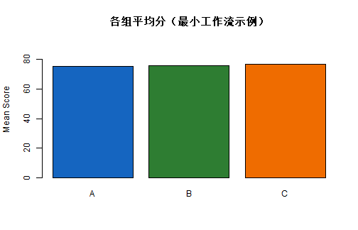

# 学习目标

- 熟悉 VS Code 中进行 R 开发的核心区域  
- 掌握从“写代码 -> 运行 -> 看结果 -> 保存产物”的最短流程  
- 建立可复现的项目目录与路径习惯  
- 学会快速定位常见操作问题  

# 1. VS Code 里最常用的区域

在 R 学习阶段，你最常用的是这 5 个区域：

1. `Explorer`：浏览和管理项目文件  
2. `Editor`：编写 `.R` / `.Rmd` 脚本  
3. `Terminal`：运行命令（如 `Rscript`）  
4. `Run and Debug`：调试断点与执行流程  
5. `Extensions`：管理 R 相关插件  

建议学习顺序：先熟练 `Explorer + Editor + Terminal`，再进入调试功能。

# 2. 建立一个可复现的项目结构

## 2.1 推荐目录模板

```text
project/
  data/
    raw/
    processed/
  scripts/
  output/
  docs/
  README.md
```

## 2.2 用 R 自动创建模板目录


``` r
tmp_project <- file.path(tempdir(), "r_vscode_project_demo")
dir.create(tmp_project, recursive = TRUE, showWarnings = FALSE)

dirs <- c(
  "data/raw",
  "data/processed",
  "scripts",
  "output",
  "docs"
)

for (d in dirs) {
  dir.create(file.path(tmp_project, d), recursive = TRUE, showWarnings = FALSE)
}

file.create(file.path(tmp_project, "README.md"))
```

```
## [1] TRUE
```

``` r
cat("模板目录位置:\n", tmp_project, "\n")
```

```
## 模板目录位置:
##  C:\Users\27743\AppData\Local\Temp\RtmpycpAYy/r_vscode_project_demo
```

## 2.3 检查目录是否创建成功


``` r
all_items <- list.files(tmp_project, recursive = TRUE, all.files = TRUE)
all_items
```

```
## [1] "README.md"
```

# 3. 脚本执行的最短工作流

我们用一个最小任务演示：读取数据 -> 计算汇总 -> 输出图表。


``` r
set.seed(123)
df <- data.frame(
  id = 1:80,
  group = sample(c("A", "B", "C"), 80, replace = TRUE),
  score = round(rnorm(80, mean = 75, sd = 8), 1)
)

head(df)
```

```
##   id group score
## 1  1     C  64.4
## 2  2     C  75.2
## 3  3     C  71.5
## 4  4     B  88.5
## 5  5     C  84.8
## 6  6     B  77.2
```


``` r
summary_df <- aggregate(score ~ group, data = df, FUN = mean)
colnames(summary_df)[2] <- "mean_score"
summary_df
```

```
##   group mean_score
## 1     A   75.20357
## 2     B   75.72800
## 3     C   76.54444
```


``` r
barplot(
  height = summary_df$mean_score,
  names.arg = summary_df$group,
  col = c("#1565C0", "#2E7D32", "#EF6C00"),
  ylim = c(0, max(summary_df$mean_score) * 1.2),
  main = "各组平均分（最小工作流示例）",
  ylab = "Mean Score"
)
```



如果你在 VS Code 中运行，建议把此流程拆成三个代码块分别执行，便于定位问题。

# 4. 工程化习惯：路径、命名、输出

## 4.1 路径管理原则

- 使用相对路径（`data/raw/file.csv`），避免写死绝对路径  
- 所有结果图和表统一写入 `output/`  
- 脚本命名使用序号前缀，例如 `01_clean.R`, `02_model.R`  

## 4.2 路径检查小工具


``` r
path_check <- function(root = ".") {
  required <- c("data", "scripts", "output")
  data.frame(
    folder = required,
    exists = dir.exists(file.path(root, required))
  )
}

path_check(".")
```

```
##    folder exists
## 1    data  FALSE
## 2 scripts  FALSE
## 3  output  FALSE
```

## 4.3 将结果写到输出目录


``` r
demo_out <- file.path(tmp_project, "output")
dir.create(demo_out, recursive = TRUE, showWarnings = FALSE)

write.csv(summary_df, file.path(demo_out, "group_summary.csv"), row.names = FALSE)
list.files(demo_out)
```

```
## [1] "group_summary.csv"
```

# 5. 常见操作问题与排查

## 5.1 终端出现 `+` 提示符

说明上一条命令未闭合（括号或引号缺失）。  
处理方法：

1. 按 `Ctrl + C` 终止当前输入
2. 检查上一条代码括号/引号是否成对

## 5.2 终端清屏但报对象不存在

原因：在 R 交互环境中输入了 `cls/clear`，R 会把它当作对象名。  
正确方式：

- 快捷键：`Ctrl + L`
- 或在 R 中输入：`cat("\014")`

## 5.3 图形不显示

排查顺序：

1. 先运行一条最小绘图语句（如 `plot(1:10)`）
2. 检查 VS Code R 扩展是否正常
3. 重启 R 会话再试

# 6. 课堂练习

## 基础练习

1. 在 VS Code 中为当前课程创建一个 workspace。  
2. 按模板建立 `data/raw`, `data/processed`, `scripts`, `output`, `docs`。  
3. 新建 `scripts/01_quick_test.R`，输出 `sessionInfo()` 到终端。  

## 进阶练习

1. 写一个脚本 `scripts/02_score_report.R`：读取模拟成绩数据，按组汇总均值，保存到 `output/group_summary.csv`。  
2. 再输出一张柱状图到 `output/group_summary.png`。  

# 7. 章末自检

- 我能解释 VS Code 中各主要面板的作用  
- 我能组织一个可复现的 R 项目目录  
- 我能在 VS Code 中完成“运行脚本 -> 查看结果 -> 保存产物”  
- 我能处理常见的终端与运行问题  

# 8. 下一节预告

下一节我们会学习：**R 数据类型**，包括向量、列表、数据框、因子以及类型转换。

