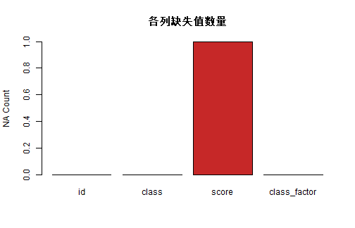
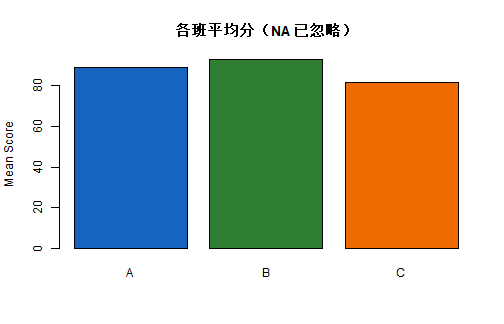

# 学习目标

- 掌握向量、矩阵、列表、数据框、因子等核心数据结构  
- 能使用 `class()`、`typeof()`、`str()` 快速识别对象类型  
- 学会常见类型转换与缺失值处理  
- 根据任务选择合适的数据结构  

# 1. 为什么数据类型重要

R 是“对象 + 函数”的语言，不同对象类型会直接影响：

1. 函数是否可用  
2. 计算是否正确  
3. 代码是否高效、可维护  

先记住一句话：**先看结构，再做分析**。

# 2. 常见数据结构快速上手

## 2.1 向量（vector）


``` r
v_num <- c(1, 2, 3, 4, 5)
v_chr <- c("A", "B", "C")

v_num
```

```
## [1] 1 2 3 4 5
```

``` r
class(v_num)
```

```
## [1] "numeric"
```

``` r
typeof(v_num)
```

```
## [1] "double"
```

要点：

- 向量要求元素“同质”（同一类型）  
- 向量是 R 最基础、最常用的数据结构  

## 2.2 矩阵（matrix）


``` r
m <- matrix(1:9, nrow = 3, byrow = TRUE)
m
```

```
##      [,1] [,2] [,3]
## [1,]    1    2    3
## [2,]    4    5    6
## [3,]    7    8    9
```

``` r
class(m)
```

```
## [1] "matrix" "array"
```

``` r
dim(m)
```

```
## [1] 3 3
```

要点：

- 矩阵是二维同质数据  
- 常用于数值计算、线性代数  

## 2.3 列表（list）


``` r
lst <- list(
  name = "sample_01",
  scores = c(88, 91, 76),
  passed = TRUE,
  mat = m
)

lst
```

```
## $name
## [1] "sample_01"
## 
## $scores
## [1] 88 91 76
## 
## $passed
## [1] TRUE
## 
## $mat
##      [,1] [,2] [,3]
## [1,]    1    2    3
## [2,]    4    5    6
## [3,]    7    8    9
```

``` r
str(lst)
```

```
## List of 4
##  $ name  : chr "sample_01"
##  $ scores: num [1:3] 88 91 76
##  $ passed: logi TRUE
##  $ mat   : int [1:3, 1:3] 1 4 7 2 5 8 3 6 9
```

要点：

- 列表可存放不同类型对象  
- 常用于封装复杂分析结果  

## 2.4 数据框（data.frame）


``` r
df <- data.frame(
  id = 1:6,
  class = c("A", "A", "B", "B", "C", "C"),
  score = c(90, 88, NA, 93, 78, 85),
  stringsAsFactors = FALSE
)

df
```

```
##   id class score
## 1  1     A    90
## 2  2     A    88
## 3  3     B    NA
## 4  4     B    93
## 5  5     C    78
## 6  6     C    85
```

``` r
str(df)
```

```
## 'data.frame':	6 obs. of  3 variables:
##  $ id   : int  1 2 3 4 5 6
##  $ class: chr  "A" "A" "B" "B" ...
##  $ score: num  90 88 NA 93 78 85
```

要点：

- 每列是一个向量，可不同类型  
- 绝大多数数据分析任务都在数据框上完成  

## 2.5 因子（factor）


``` r
df$class_factor <- factor(df$class, levels = c("A", "B", "C"))
df$class_factor
```

```
## [1] A A B B C C
## Levels: A B C
```

``` r
str(df$class_factor)
```

```
##  Factor w/ 3 levels "A","B","C": 1 1 2 2 3 3
```

``` r
class(df$class_factor)
```

```
## [1] "factor"
```

``` r
typeof(df$class_factor)
```

```
## [1] "integer"
```

``` r
levels(df$class_factor)
```

```
## [1] "A" "B" "C"
```

``` r
table(df$class_factor)
```

```
## 
## A B C 
## 2 2 2
```

要点：

- 因子用于表示分类变量，内部本质是“整数编码 + levels 标签”  
- `levels` 的顺序会影响排序、分组展示和建模参考组  
- 在建模中很常见（如分组、哑变量）  

### 2.5.1 因子的底层编码（为什么它不是普通字符）


``` r
unclass(df$class_factor)
```

```
## [1] 1 1 2 2 3 3
## attr(,"levels")
## [1] "A" "B" "C"
```

``` r
data.frame(
  class = as.character(df$class_factor),
  code = unclass(df$class_factor)
)
```

```
##   class code
## 1     A    1
## 2     A    1
## 3     B    2
## 4     B    2
## 5     C    3
## 6     C    3
```

说明：

- `A/B/C` 会被映射到整数编码（如 1/2/3）  
- 显示时看到的是标签，计算时可能依赖编码和 levels 顺序  

### 2.5.2 有序因子（ordered factor）

有序因子用于“等级有顺序”的分类，如 `low < mid < high`。


``` r
level_text <- c("low", "mid", "high", "mid", "low")
level_fac <- factor(level_text, levels = c("low", "mid", "high"), ordered = TRUE)

level_fac
```

```
## [1] low  mid  high mid  low 
## Levels: low < mid < high
```

``` r
is.ordered(level_fac)
```

```
## [1] TRUE
```

``` r
sort(level_fac)
```

```
## [1] low  low  mid  mid  high
## Levels: low < mid < high
```

### 2.5.3 参考水平（reference level）与建模

回归/分类建模时，因子的第一个 level 通常是参考组。


``` r
g1 <- factor(c("A", "A", "B", "C", "B", "C"), levels = c("A", "B", "C"))
g2 <- relevel(g1, ref = "B")

levels(g1)
```

```
## [1] "A" "B" "C"
```

``` r
levels(g2)
```

```
## [1] "B" "A" "C"
```

``` r
model.matrix(~ g1)
```

```
##   (Intercept) g1B g1C
## 1           1   0   0
## 2           1   0   0
## 3           1   1   0
## 4           1   0   1
## 5           1   1   0
## 6           1   0   1
## attr(,"assign")
## [1] 0 1 1
## attr(,"contrasts")
## attr(,"contrasts")$g1
## [1] "contr.treatment"
```

``` r
model.matrix(~ g2)
```

```
##   (Intercept) g2A g2C
## 1           1   1   0
## 2           1   1   0
## 3           1   0   0
## 4           1   0   1
## 5           1   0   0
## 6           1   0   1
## attr(,"assign")
## [1] 0 1 1
## attr(,"contrasts")
## attr(,"contrasts")$g2
## [1] "contr.treatment"
```

说明：只改参考组，就会改变哑变量展开方式和系数解释口径。

### 2.5.4 常见坑：`as.numeric(factor)` 不是原始数值


``` r
f_num_text <- factor(c("10", "20", "30"))

wrong_num <- as.numeric(f_num_text)
right_num <- as.numeric(as.character(f_num_text))

data.frame(
  factor_value = f_num_text,
  wrong_as_numeric = wrong_num,
  right_as_numeric = right_num
)
```

```
##   factor_value wrong_as_numeric right_as_numeric
## 1           10                1               10
## 2           20                2               20
## 3           30                3               30
```

结论：

- 直接 `as.numeric(factor)` 得到的是“编码值”（1,2,3...）  
- 若要回到真实数字，应先 `as.character()` 再 `as.numeric()`  

### 2.5.5 过滤数据后的“空 levels”处理


``` r
df_sub <- subset(df, class %in% c("A", "B"))
fac_sub <- factor(df_sub$class, levels = c("A", "B", "C"))

levels_before <- levels(fac_sub)
fac_sub_clean <- droplevels(fac_sub)
levels_after <- levels(fac_sub_clean)

levels_before
```

```
## [1] "A" "B" "C"
```

``` r
levels_after
```

```
## [1] "A" "B"
```

这一步在分组统计和作图前很实用，可避免“看不到数据却保留分类标签”的混乱。

# 3. 类型检查与类型转换

## 3.1 快速检查函数


``` r
obj_list <- list(v_num = v_num, m = m, lst = lst, df = df)
sapply(obj_list, class)
```

```
## $v_num
## [1] "numeric"
## 
## $m
## [1] "matrix" "array" 
## 
## $lst
## [1] "list"
## 
## $df
## [1] "data.frame"
```

``` r
sapply(obj_list, typeof)
```

```
##     v_num         m       lst        df 
##  "double" "integer"    "list"    "list"
```

常用检查函数：

- `class()`：对象类别  
- `typeof()`：底层存储类型  
- `str()`：结构总览  

## 3.2 常见类型转换


``` r
x_chr <- c("10", "20", "30")
x_num <- as.numeric(x_chr)

flag_num <- c(1, 0, 1, 1, 0)
flag_logical <- as.logical(flag_num)

grade_chr <- c("low", "mid", "high", "mid")
grade_factor <- factor(grade_chr, levels = c("low", "mid", "high"))

x_num
```

```
## [1] 10 20 30
```

``` r
flag_logical
```

```
## [1]  TRUE FALSE  TRUE  TRUE FALSE
```

``` r
grade_factor
```

```
## [1] low  mid  high mid 
## Levels: low mid high
```

注意：`as.numeric()` 转换失败时会产生 `NA`，要及时检查。


``` r
bad_chr <- c("10", "A", "30")
bad_num <- suppressWarnings(as.numeric(bad_chr))
data.frame(raw = bad_chr, converted = bad_num)
```

```
##   raw converted
## 1  10        10
## 2   A        NA
## 3  30        30
```

# 4. 缺失值处理（NA）

## 4.1 识别缺失值


``` r
is.na(df)
```

```
##         id class score class_factor
## [1,] FALSE FALSE FALSE        FALSE
## [2,] FALSE FALSE FALSE        FALSE
## [3,] FALSE FALSE  TRUE        FALSE
## [4,] FALSE FALSE FALSE        FALSE
## [5,] FALSE FALSE FALSE        FALSE
## [6,] FALSE FALSE FALSE        FALSE
```

``` r
colSums(is.na(df))
```

```
##           id        class        score class_factor 
##            0            0            1            0
```

## 4.2 常见处理策略


``` r
# 1) 删除缺失值行
df_drop <- na.omit(df)

# 2) 用均值填补（示例）
df_fill <- df
mean_score <- mean(df_fill$score, na.rm = TRUE)
df_fill$score[is.na(df_fill$score)] <- round(mean_score, 1)

df_drop
```

```
##   id class score class_factor
## 1  1     A    90            A
## 2  2     A    88            A
## 4  4     B    93            B
## 5  5     C    78            C
## 6  6     C    85            C
```

``` r
df_fill
```

```
##   id class score class_factor
## 1  1     A  90.0            A
## 2  2     A  88.0            A
## 3  3     B  86.8            B
## 4  4     B  93.0            B
## 5  5     C  78.0            C
## 6  6     C  85.0            C
```

## 4.3 缺失值情况可视化


``` r
na_count <- colSums(is.na(df))
barplot(
  na_count,
  col = "#C62828",
  main = "各列缺失值数量",
  ylab = "NA Count"
)
```



# 5. 结合因子进行分组统计


``` r
df_work <- df
df_work$class <- factor(df_work$class, levels = c("A", "B", "C"))

group_mean <- aggregate(score ~ class, data = df_work, FUN = function(x) mean(x, na.rm = TRUE))
group_mean
```

```
##   class score
## 1     A  89.0
## 2     B  93.0
## 3     C  81.5
```


``` r
barplot(
  group_mean$score,
  names.arg = group_mean$class,
  col = c("#1565C0", "#2E7D32", "#EF6C00"),
  main = "各班平均分（NA 已忽略）",
  ylab = "Mean Score"
)
```



# 6. 课堂练习

## 基础练习

1. 构造一个 10 行数据框，包含 `id`, `class`, `score`。  
2. 用 `str()`、`class()`、`typeof()` 检查每列类型。  
3. 人为加入 2 个 `NA`，统计每列缺失值个数。  

## 进阶练习

1. 将 `class` 转为因子并设定顺序。  
2. 分别用“删除缺失值”和“均值填补”两种方式计算各班平均分。  
3. 对比两种方式得到的结果差异，并写出原因。  
4. 设计一个三等级变量（如 low/mid/high），分别测试：  
   - `ordered = FALSE` 与 `ordered = TRUE` 的行为差异  
   - 更换参考水平后 `model.matrix()` 输出的变化  

# 7. 章末自检

- 我能区分 `vector`、`matrix`、`list`、`data.frame`、`factor`  
- 我能用 `str()` 快速读懂数据结构  
- 我能完成常见类型转换并识别转换风险  
- 我能处理 `NA` 并解释处理策略对结果的影响  

# 8. 下一节预告

下一节我们会学习：**R 基本语法**，包括函数、条件判断、循环和向量化思维。
