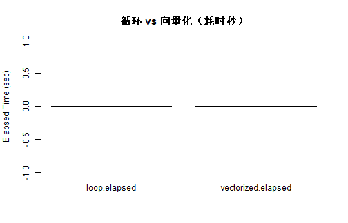
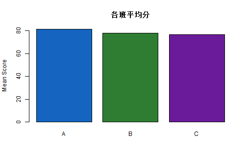

# 学习目标

- 掌握变量、函数、条件与循环的核心语法  
- 理解向量化思维，减少低效循环  
- 会使用 `apply/lapply/sapply` 处理批量任务  
- 能写出可复用、可检查、可调试的函数  

# 1. 变量与对象

R 里“变量”本质是对象绑定，最常见赋值写法是 `<-`。


``` r
x <- 10
y <- c(1, 2, 3, 4)
name <- "R learner"

x
```

```
## [1] 10
```

``` r
y
```

```
## [1] 1 2 3 4
```

``` r
name
```

```
## [1] "R learner"
```

建议：

1. 变量名用有含义的英文（如 `student_score`）  
2. 同一脚本内保持命名风格统一  
3. 避免使用 `T/F` 作为逻辑值（建议用 `TRUE/FALSE`）  

# 2. 条件语句

## 2.1 `if / else`（单值判断）


``` r
score <- 86

if (score >= 90) {
  grade <- "A"
} else if (score >= 80) {
  grade <- "B"
} else if (score >= 70) {
  grade <- "C"
} else {
  grade <- "D"
}

grade
```

```
## [1] "B"
```

要点：`if` 条件必须是长度为 1 的逻辑值。

## 2.2 `ifelse()`（向量化判断）


``` r
scores <- c(95, 88, 72, 64)
pass_flag <- ifelse(scores >= 60, "Pass", "Fail")
pass_flag
```

```
## [1] "Pass" "Pass" "Pass" "Pass"
```

## 2.3 `switch()`（按选项分支）


``` r
calc <- function(op, a, b) {
  switch(
    op,
    add = a + b,
    sub = a - b,
    mul = a * b,
    div = if (b == 0) NA else a / b,
    NA
  )
}

calc("add", 8, 2)
```

```
## [1] 10
```

``` r
calc("div", 8, 0)
```

```
## [1] NA
```

# 3. 循环语句

## 3.1 `for` 循环


``` r
nums <- 1:5
out <- numeric(length(nums))

for (i in seq_along(nums)) {
  out[i] <- nums[i]^2
}

out
```

```
## [1]  1  4  9 16 25
```

要点：循环前预分配容器（如 `numeric(length(...))`）会更高效。

## 3.2 `while` 循环


``` r
count <- 1
acc <- 0

while (count <= 5) {
  acc <- acc + count
  count <- count + 1
}

acc
```

```
## [1] 15
```

## 3.3 `repeat` + `break`


``` r
i <- 0
vals <- c()

repeat {
  i <- i + 1
  vals <- c(vals, i)
  if (i >= 4) break
}

vals
```

```
## [1] 1 2 3 4
```

## 3.4 `next` 跳过当前迭代


``` r
evens <- c()
for (i in 1:8) {
  if (i %% 2 == 1) next
  evens <- c(evens, i)
}
evens
```

```
## [1] 2 4 6 8
```

# 4. 函数：可复用的最小单元

## 4.1 函数定义与默认参数


``` r
z_score <- function(x, na.rm = TRUE) {
  m <- mean(x, na.rm = na.rm)
  s <- sd(x, na.rm = na.rm)
  (x - m) / s
}

z_score(c(78, 85, 92, 88, 95))
```

```
## [1] -1.45890591 -0.39512035  0.66866521  0.06078775  1.12457331
```

## 4.2 输入检查（让函数更稳）


``` r
safe_mean <- function(x, na.rm = TRUE) {
  if (!is.numeric(x)) stop("x must be numeric")
  if (all(is.na(x))) return(NA_real_)
  mean(x, na.rm = na.rm)
}

safe_mean(c(1, 2, 3, NA))
```

```
## [1] 2
```

## 4.3 返回值与作用域


``` r
calc_stats <- function(x) {
  list(
    n = length(x),
    mean = mean(x),
    sd = sd(x)
  )
}

res <- calc_stats(c(10, 12, 9, 15, 14))
res
```

```
## $n
## [1] 5
## 
## $mean
## [1] 12
## 
## $sd
## [1] 2.54951
```

# 5. 向量化思维（重点）

同样任务，向量化通常比逐元素循环更简洁、更快。


``` r
set.seed(42)
x <- rnorm(50000)

loop_square <- function(v) {
  out <- numeric(length(v))
  for (i in seq_along(v)) {
    out[i] <- v[i]^2
  }
  out
}

t_loop <- system.time(loop_square(x))
t_vec <- system.time(x^2)

timing <- c(loop = t_loop["elapsed"], vectorized = t_vec["elapsed"])
timing
```

```
##       loop.elapsed vectorized.elapsed 
##                  0                  0
```


``` r
barplot(
  timing,
  col = c("#EF6C00", "#2E7D32"),
  main = "循环 vs 向量化（耗时秒）",
  ylab = "Elapsed Time (sec)"
)
```



# 6. `apply` 家族

## 6.1 `apply()`：矩阵按行/列处理


``` r
mat <- matrix(1:12, nrow = 3, byrow = TRUE)
mat
```

```
##      [,1] [,2] [,3] [,4]
## [1,]    1    2    3    4
## [2,]    5    6    7    8
## [3,]    9   10   11   12
```

``` r
row_sum <- apply(mat, 1, sum)
col_mean <- apply(mat, 2, mean)

row_sum
```

```
## [1] 10 26 42
```

``` r
col_mean
```

```
## [1] 5 6 7 8
```

## 6.2 `lapply()`：对列表每个元素做同一操作


``` r
lst <- list(a = 1:3, b = 4:7, c = c(2, 9))
lapply(lst, length)
```

```
## $a
## [1] 3
## 
## $b
## [1] 4
## 
## $c
## [1] 2
```

## 6.3 `sapply()`：在可简化时返回向量/矩阵


``` r
sapply(lst, sum)
```

```
##  a  b  c 
##  6 22 11
```

什么时候用：

1. 输入是矩阵，按行/列处理：`apply`  
2. 输入是列表，输出保持列表：`lapply`  
3. 输入是列表，想要简化结果：`sapply`  

# 7. 常见错误与调试

## 7.1 典型错误示例


``` r
bad_div <- function(a, b) {
  a / b
}

bad_div(10, 0)
```

```
## [1] Inf
```

`Inf` 或 `NaN` 不一定报错，但通常提示你的数据或逻辑需要检查。

## 7.2 快速调试工具


``` r
# 出错后查看调用栈
traceback()

# 在函数里插入断点
browser()

# 或直接调试函数
debug(your_function_name)
```

# 8. 综合小案例（语法串联）

目标：把分数转等级，并输出班级均分与等级分布。


``` r
score_to_grade <- function(score) {
  ifelse(score >= 90, "A",
         ifelse(score >= 80, "B",
                ifelse(score >= 70, "C", "D")))
}

df <- data.frame(
  id = 1:12,
  class = rep(c("A", "B", "C"), each = 4),
  score = c(95, 86, 78, 67, 88, 92, 71, 60, 83, 76, 90, 58)
)

df$grade <- score_to_grade(df$score)

class_mean <- aggregate(score ~ class, data = df, FUN = mean)
grade_dist <- table(df$grade)

class_mean
```

```
##   class score
## 1     A 81.50
## 2     B 77.75
## 3     C 76.75
```

``` r
grade_dist
```

```
## 
## A B C D 
## 3 3 3 3
```


``` r
barplot(
  class_mean$score,
  names.arg = class_mean$class,
  col = c("#1565C0", "#2E7D32", "#6A1B9A"),
  main = "各班平均分",
  ylab = "Mean Score"
)
```



# 9. 课堂练习

## 基础练习

1. 写函数 `z_score(x)` 返回标准化向量。  
2. 写函数 `safe_mean(x)`：当全为 `NA` 时返回 `NA`。  
3. 用 `ifelse()` 对一组分数打“及格/不及格”标签。  

## 进阶练习

1. 用 `for` 与向量化分别实现“平方和”计算，对比耗时。  
2. 用 `apply` 计算一个 4x5 矩阵的行和、列均值。  
3. 写一个 `grade_summary(df)` 函数，返回：
   - 各班平均分
   - 各等级人数

# 10. 章末自检

- 我会写带默认参数和输入检查的函数  
- 我知道 `if` 与 `ifelse` 的使用边界  
- 我会使用 `for/while/repeat` 并控制循环退出  
- 我能用向量化和 `apply` 家族优化基础代码  

# 11. 下一节预告

下一节进入数据处理：`dplyr` 管道、分组汇总、连接合并和数据清洗流程。

