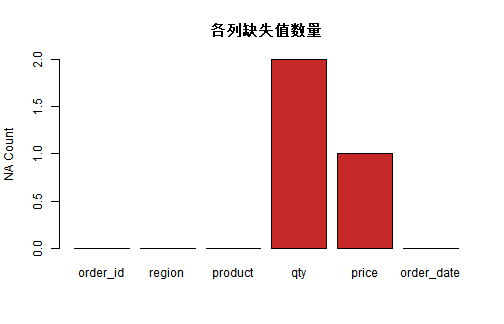
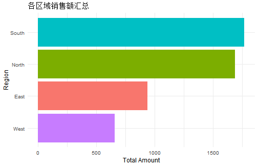

# 学习目标

- 掌握“读入 -> 清洗 -> 变换 -> 汇总 -> 输出”的完整流程  
- 熟练使用 `dplyr` 和 `tidyr` 的核心动词  
- 能解释 `left_join` 后 `NA` 的来源  
- 能写出可复用的数据处理管道函数  

# 1. 数据处理总流程

一条稳定的数据处理链通常分 5 步：

1. 读入数据（`read_csv`）  
2. 质量检查（缺失值、重复值、类型）  
3. 清洗与变换（`mutate/filter/case_when`）  
4. 分组汇总（`group_by/summarise`）  
5. 输出结果（表格/图表/文件）  

# 2. 准备示例数据并读入


``` r
suppressPackageStartupMessages({
  library(dplyr)
  library(tidyr)
  library(readr)
  library(ggplot2)
})
```


``` r
tmp_csv <- file.path(tempdir(), "sales_demo.csv")

sales_raw <- data.frame(
  order_id = c(1001, 1002, 1003, 1003, 1004, 1005, 1006, 1007, 1008, 1009),
  region = c("East", "West", "East", "East", "North", "South", "West", "South", "East", "North"),
  product = c("A", "B", "A", "A", "C", "B", "A", "C", "B", "A"),
  qty = c(3, 2, NA, NA, 5, 4, 2, 3, 1, 6),
  price = c(120, 200, 120, 120, NA, 210, 130, 310, 220, 140),
  order_date = c("2026-01-03", "2026-01-05", "2026-01-08", "2026-01-08", "2026-01-12",
                 "2026-01-15", "2026-01-17", "2026-01-20", "2026-01-25", "2026-01-27"),
  stringsAsFactors = FALSE
)

write_csv(sales_raw, tmp_csv)
sales <- read_csv(tmp_csv, show_col_types = FALSE)

sales
```

```
## # A tibble: 10 × 6
##    order_id region product   qty price order_date
##       <dbl> <chr>  <chr>   <dbl> <dbl> <date>    
##  1     1001 East   A           3   120 2026-01-03
##  2     1002 West   B           2   200 2026-01-05
##  3     1003 East   A          NA   120 2026-01-08
##  4     1003 East   A          NA   120 2026-01-08
##  5     1004 North  C           5    NA 2026-01-12
##  6     1005 South  B           4   210 2026-01-15
##  7     1006 West   A           2   130 2026-01-17
##  8     1007 South  C           3   310 2026-01-20
##  9     1008 East   B           1   220 2026-01-25
## 10     1009 North  A           6   140 2026-01-27
```

# 3. 数据质量检查

## 3.1 结构与基础统计


``` r
glimpse(sales)
```

```
## Rows: 10
## Columns: 6
## $ order_id   <dbl> 1001, 1002, 1003, 1003, 1004, 1005, 1006, 1007, 1008, 1009
## $ region     <chr> "East", "West", "East", "East", "North", "South", "West", "…
## $ product    <chr> "A", "B", "A", "A", "C", "B", "A", "C", "B", "A"
## $ qty        <dbl> 3, 2, NA, NA, 5, 4, 2, 3, 1, 6
## $ price      <dbl> 120, 200, 120, 120, NA, 210, 130, 310, 220, 140
## $ order_date <date> 2026-01-03, 2026-01-05, 2026-01-08, 2026-01-08, 2026-01-12,…
```

``` r
summary(sales)
```

```
##     order_id       region            product               qty      
##  Min.   :1001   Length:10          Length:10          Min.   :1.00  
##  1st Qu.:1003   Class :character   Class :character   1st Qu.:2.00  
##  Median :1004   Mode  :character   Mode  :character   Median :3.00  
##  Mean   :1005                                         Mean   :3.25  
##  3rd Qu.:1007                                         3rd Qu.:4.25  
##  Max.   :1009                                         Max.   :6.00  
##                                                       NA's   :2     
##      price         order_date        
##  Min.   :120.0   Min.   :2026-01-03  
##  1st Qu.:120.0   1st Qu.:2026-01-08  
##  Median :140.0   Median :2026-01-13  
##  Mean   :174.4   Mean   :2026-01-14  
##  3rd Qu.:210.0   3rd Qu.:2026-01-19  
##  Max.   :310.0   Max.   :2026-01-27  
##  NA's   :1
```

## 3.2 缺失值与重复值


``` r
na_count <- colSums(is.na(sales))
dup_count <- sum(duplicated(sales))

na_count
```

```
##   order_id     region    product        qty      price order_date 
##          0          0          0          2          1          0
```

``` r
dup_count
```

```
## [1] 1
```


``` r
barplot(
  na_count,
  col = "#C62828",
  main = "各列缺失值数量",
  ylab = "NA Count"
)
```



# 4. 清洗：去重、缺失处理、类型矫正


``` r
sales_clean <- sales %>%
  distinct() %>%  # 去掉完全重复行
  mutate(
    order_date = as.Date(order_date),
    qty = if_else(is.na(qty), median(qty, na.rm = TRUE), qty),
    price = if_else(is.na(price), median(price, na.rm = TRUE), price)
  )

sales_clean
```

```
## # A tibble: 9 × 6
##   order_id region product   qty price order_date
##      <dbl> <chr>  <chr>   <dbl> <dbl> <date>    
## 1     1001 East   A           3   120 2026-01-03
## 2     1002 West   B           2   200 2026-01-05
## 3     1003 East   A           3   120 2026-01-08
## 4     1004 North  C           5   170 2026-01-12
## 5     1005 South  B           4   210 2026-01-15
## 6     1006 West   A           2   130 2026-01-17
## 7     1007 South  C           3   310 2026-01-20
## 8     1008 East   B           1   220 2026-01-25
## 9     1009 North  A           6   140 2026-01-27
```


``` r
data.frame(
  stage = c("raw", "clean"),
  rows = c(nrow(sales), nrow(sales_clean))
)
```

```
##   stage rows
## 1   raw   10
## 2 clean    9
```

# 5. 变换：新增字段与分类标签


``` r
sales_feature <- sales_clean %>%
  mutate(
    amount = qty * price,
    month = format(order_date, "%Y-%m"),
    order_level = case_when(
      amount >= 900 ~ "high",
      amount >= 500 ~ "mid",
      TRUE ~ "low"
    )
  )

sales_feature
```

```
## # A tibble: 9 × 9
##   order_id region product   qty price order_date amount month   order_level
##      <dbl> <chr>  <chr>   <dbl> <dbl> <date>      <dbl> <chr>   <chr>      
## 1     1001 East   A           3   120 2026-01-03    360 2026-01 low        
## 2     1002 West   B           2   200 2026-01-05    400 2026-01 low        
## 3     1003 East   A           3   120 2026-01-08    360 2026-01 low        
## 4     1004 North  C           5   170 2026-01-12    850 2026-01 mid        
## 5     1005 South  B           4   210 2026-01-15    840 2026-01 mid        
## 6     1006 West   A           2   130 2026-01-17    260 2026-01 low        
## 7     1007 South  C           3   310 2026-01-20    930 2026-01 high       
## 8     1008 East   B           1   220 2026-01-25    220 2026-01 low        
## 9     1009 North  A           6   140 2026-01-27    840 2026-01 mid
```

# 6. 汇总：分组统计


``` r
region_summary <- sales_feature %>%
  group_by(region) %>%
  summarise(
    n_orders = n(),
    total_amount = sum(amount),
    avg_amount = mean(amount),
    .groups = "drop"
  ) %>%
  arrange(desc(total_amount))

region_summary
```

```
## # A tibble: 4 × 4
##   region n_orders total_amount avg_amount
##   <chr>     <int>        <dbl>      <dbl>
## 1 South         2         1770       885 
## 2 North         2         1690       845 
## 3 East          3          940       313.
## 4 West          2          660       330
```


``` r
ggplot(region_summary, aes(x = reorder(region, total_amount), y = total_amount, fill = region)) +
  geom_col(show.legend = FALSE) +
  coord_flip() +
  labs(
    title = "各区域销售额汇总",
    x = "Region",
    y = "Total Amount"
  ) +
  theme_minimal(base_size = 12)
```



# 7. 合并：`left_join` 与 `inner_join`


``` r
region_manager <- tibble::tibble(
  region = c("East", "West", "South"),  # 故意缺少 North
  manager = c("Alice", "Bob", "Carol")
)

left_join_result <- sales_feature %>%
  left_join(region_manager, by = "region")

inner_join_result <- sales_feature %>%
  inner_join(region_manager, by = "region")

c(
  left_join_rows = nrow(left_join_result),
  inner_join_rows = nrow(inner_join_result)
)
```

```
##  left_join_rows inner_join_rows 
##               9               7
```


``` r
left_join_result %>%
  filter(is.na(manager)) %>%
  select(order_id, region, amount, manager)
```

```
## # A tibble: 2 × 4
##   order_id region amount manager
##      <dbl> <chr>   <dbl> <chr>  
## 1     1004 North     850 <NA>   
## 2     1009 North     840 <NA>
```

解释：

- `left_join` 保留左表全部行，匹配不到会出现 `NA`  
- `inner_join` 只保留双方都能匹配上的行  

# 8. 宽表与长表转换


``` r
monthly_region <- sales_feature %>%
  group_by(month, region) %>%
  summarise(total_amount = sum(amount), .groups = "drop")

wide_tbl <- monthly_region %>%
  pivot_wider(names_from = region, values_from = total_amount, values_fill = 0)

long_tbl <- wide_tbl %>%
  pivot_longer(cols = -month, names_to = "region", values_to = "total_amount")

wide_tbl
```

```
## # A tibble: 1 × 5
##   month    East North South  West
##   <chr>   <dbl> <dbl> <dbl> <dbl>
## 1 2026-01   940  1690  1770   660
```

``` r
long_tbl
```

```
## # A tibble: 4 × 3
##   month   region total_amount
##   <chr>   <chr>         <dbl>
## 1 2026-01 East            940
## 2 2026-01 North          1690
## 3 2026-01 South          1770
## 4 2026-01 West            660
```

什么时候用：

1. 便于人阅读或导出报表：宽表  
2. 便于建模和可视化：长表  

# 9. 封装一个可复用清洗函数


``` r
clean_sales_data <- function(df) {
  stopifnot(is.data.frame(df))
  required_cols <- c("order_id", "region", "product", "qty", "price", "order_date")
  miss_cols <- setdiff(required_cols, names(df))
  if (length(miss_cols) > 0) stop("Missing columns: ", paste(miss_cols, collapse = ", "))

  df %>%
    distinct() %>%
    mutate(
      order_date = as.Date(order_date),
      qty = if_else(is.na(qty), median(qty, na.rm = TRUE), qty),
      price = if_else(is.na(price), median(price, na.rm = TRUE), price),
      amount = qty * price
    )
}

sales_func <- clean_sales_data(sales)
head(sales_func, 3)
```

```
## # A tibble: 3 × 7
##   order_id region product   qty price order_date amount
##      <dbl> <chr>  <chr>   <dbl> <dbl> <date>      <dbl>
## 1     1001 East   A           3   120 2026-01-03    360
## 2     1002 West   B           2   200 2026-01-05    400
## 3     1003 East   A           3   120 2026-01-08    360
```

# 10. 输出结果文件（示例）


``` r
dir.create("output", showWarnings = FALSE)
write_csv(region_summary, "output/region_summary.csv")
ggsave("output/region_summary.png", width = 7, height = 4.5, dpi = 300)
```

# 11. 课堂练习

## 基础练习

1. 用 `iris` 按 `Species` 计算每列均值。  
2. 增加一列 `sepal_ratio = Sepal.Length / Sepal.Width`。  
3. 检查是否有缺失值并输出每列 NA 数量。  

## 进阶练习

1. 构造两个表（主表 + 维度表），分别做 `left_join` 和 `inner_join`。  
2. 找出 `left_join` 后产生 `NA` 的记录并解释原因。  
3. 将结果从长表转宽表，再转回长表，比较行数是否一致。  

# 12. 章末自检

- 我能写出 5 步以内的数据清洗管道  
- 我能解释 `mutate/filter/group_by/summarise` 的职责  
- 我能判断何时使用 `left_join` 或 `inner_join`  
- 我能在宽表和长表之间转换并理解场景  

# 13. 下一节预告

下一节我们会学习回归与分类：从建模、评估到结果解释的完整流程。
