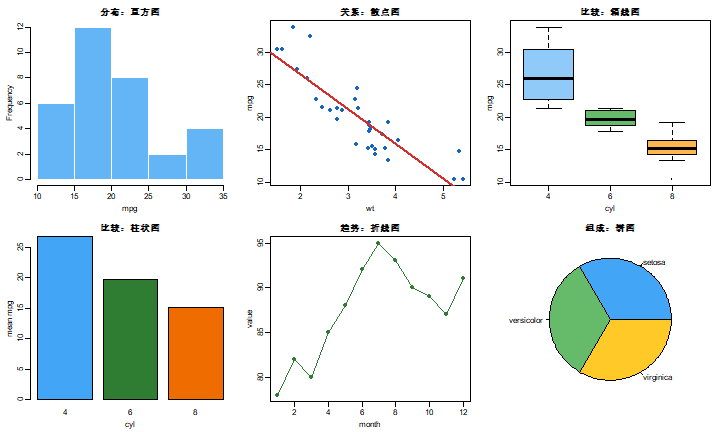
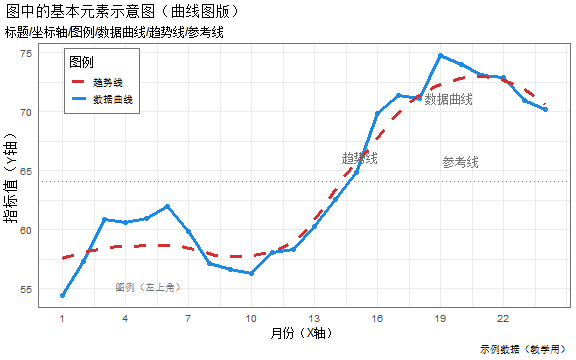
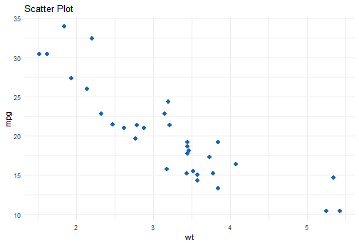
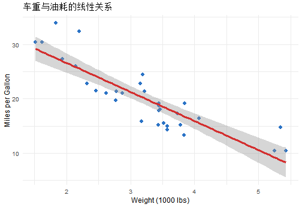
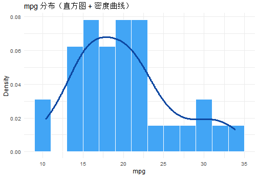
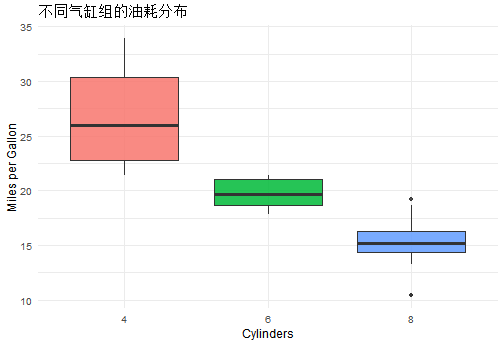
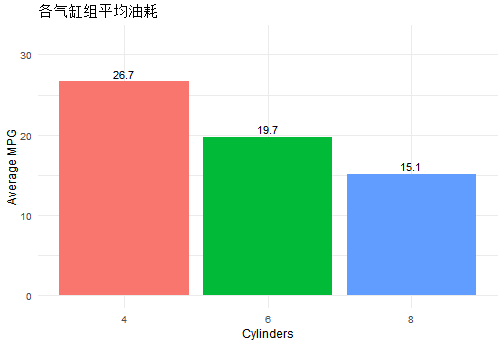
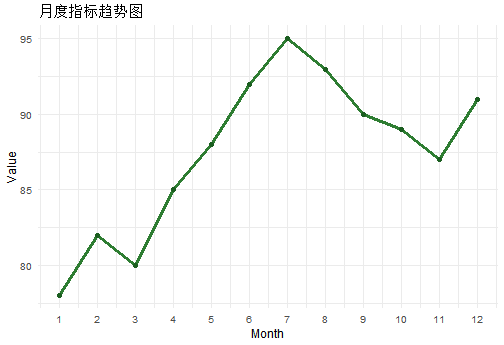
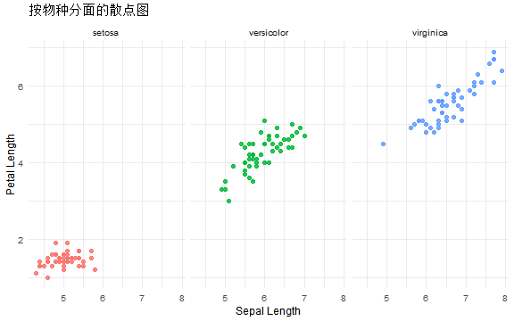
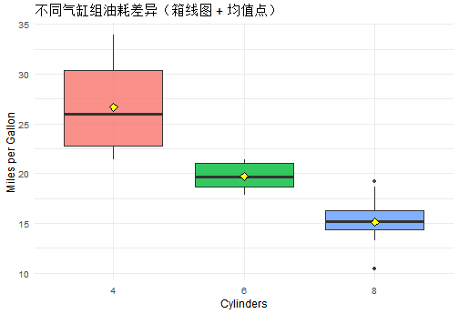

# 学习目标

- 先认识常见图形类型与适用问题  
- 理解一张图的基本元素（标题、坐标轴、图例、配色、注释）  
- 掌握 `ggplot2` 的核心语法并能独立完成常见图形  
- 学会输出清晰、规范、可用于报告的图表  

# 1. 先认识：常见图类型

在“怎么画”之前，先回答“为什么画这张图”。  
你可以按分析目标选图：

1. 看分布：直方图、密度图、箱线图  
2. 看关系：散点图、拟合线  
3. 看比较：柱状图、分组箱线图  
4. 看趋势：折线图、时间序列图  
5. 看组成：堆叠柱图、饼图（科研场景一般少用）  

## 1.1 图类型与问题匹配表

| 分析问题 | 推荐图形 | 典型场景 |
|---|---|---|
| 变量值分布如何？ | 直方图/密度图 | 分析表达量、评分分布 |
| 两个变量是否相关？ | 散点图 + 拟合线 | 体重与油耗、剂量与反应 |
| 多组是否有差异？ | 箱线图/小提琴图 | 处理组 vs 对照组 |
| 各组总量谁更高？ | 柱状图 | 各地区销售额比较 |
| 指标随时间如何变化？ | 折线图 | 月度趋势、随访变化 |

## 1.2 图类型示例画廊（快速建立直觉）


``` r
old_par <- par(no.readonly = TRUE)
on.exit(par(old_par))
par(mfrow = c(2, 3), mar = c(3.2, 3.2, 2.2, 1.0), mgp = c(1.8, 0.6, 0))

# 1) 分布：直方图
hist(mtcars$mpg, col = "#64B5F6", border = "white", main = "分布：直方图", xlab = "mpg")

# 2) 关系：散点图 + 拟合线
plot(mtcars$wt, mtcars$mpg, pch = 19, col = "#1565C0", main = "关系：散点图", xlab = "wt", ylab = "mpg")
abline(lm(mpg ~ wt, data = mtcars), col = "#D32F2F", lwd = 2)

# 3) 比较：箱线图
boxplot(mpg ~ cyl, data = mtcars, col = c("#90CAF9", "#66BB6A", "#FFB74D"),
        main = "比较：箱线图", xlab = "cyl", ylab = "mpg")

# 4) 比较：柱状图（汇总）
bar_vals <- tapply(mtcars$mpg, mtcars$cyl, mean)
barplot(bar_vals, col = c("#42A5F5", "#2E7D32", "#EF6C00"),
        main = "比较：柱状图", xlab = "cyl", ylab = "mean mpg")

# 5) 趋势：折线图
month <- 1:12
value <- c(78, 82, 80, 85, 88, 92, 95, 93, 90, 89, 87, 91)
plot(month, value, type = "o", pch = 16, col = "#2E7D32",
     main = "趋势：折线图", xlab = "month", ylab = "value")

# 6) 组成：饼图（演示用）
pie(table(iris$Species), col = c("#42A5F5", "#66BB6A", "#FFCA28"), main = "组成：饼图")
```



# 2. 再认识：图中的基本元素

一张可读的图至少要有这些元素：

1. 标题：说明图在回答什么问题  
2. X/Y 轴名称与单位：避免“数字有了但含义不清”  
3. 图例：解释颜色/形状代表什么  
4. 比例与范围：坐标轴区间要合理，不误导  
5. 视觉编码：颜色、大小、透明度要有逻辑  
6. 注释与参考线：帮助读者快速抓住关键点  

## 2.1 一张曲线图说明“基本元素”


``` r
library(ggplot2)

set.seed(123)
curve_df <- data.frame(
  month = 1:24,
  value = 52 + 0.9 * (1:24) + 5 * sin((1:24) / 2.4) + rnorm(24, sd = 0.9)
)

ref_y <- mean(curve_df$value)

ggplot(curve_df, aes(x = month, y = value)) +
  geom_line(aes(color = "数据曲线"), linewidth = 1.1) +
  geom_point(color = "#1E88E5", size = 2.1, alpha = 0.9) +
  geom_smooth(aes(color = "趋势线"), method = "loess", se = FALSE, linewidth = 1.1, linetype = 2) +
  geom_hline(yintercept = ref_y, linetype = 3, color = "gray45") +
  scale_color_manual(values = c("数据曲线" = "#1E88E5", "趋势线" = "#D32F2F")) +
  scale_x_continuous(breaks = seq(1, 24, 3)) +
  labs(
    title = "图中的基本元素示意图（曲线图版）",
    subtitle = "标题/坐标轴/图例/数据曲线/趋势线/参考线",
    x = "月份（X轴）",
    y = "指标值（Y轴）",
    color = "图例",
    caption = "示例数据（教学用）"
  ) +
  annotate("text", x = 19.4, y = 71.2, label = "数据曲线", color = "gray45", size = 3.7) +
  annotate("text", x = 15.2, y = 66.2, label = "趋势线", color = "gray45", size = 3.7) +
  annotate("text", x = 20.0, y = ref_y + 1.7, label = "参考线", color = "gray45", size = 3.7) +
  annotate("text", x = 5.2, y = 55.2, label = "图例（左上角）", color = "gray45", size = 3.6) +
  theme_minimal(base_size = 12) +
  theme(
    legend.position = c(0.12, 0.86),
    legend.background = element_rect(fill = "white", color = "gray45", linewidth = 0.5),
    legend.box.background = element_rect(fill = "white", color = "gray45", linewidth = 0.5),
    panel.border = element_rect(color = "gray45", fill = NA, linewidth = 0.6),
    plot.title.position = "plot"
  )
```



读图时可以按这个顺序看：

1. 标题与副标题（先知道在回答什么问题）  
2. 坐标轴（知道每个方向代表什么）  
3. 图例（知道颜色/形状对应哪组）  
4. 数据点与趋势线（看关系方向和强弱）  
5. 参考线/注释（抓住重点阈值或结论）  

# 3. 进入绘图：`ggplot2` 语法骨架

`ggplot2` 的核心思路是“图层语法”：

```r
ggplot(data, aes(...)) +
  geom_...() +
  labs(...) +
  theme_...()
```

你可以把它拆成四步：

1. 选数据（`data`）  
2. 设映射（`aes`）  
3. 加几何层（`geom_*`）  
4. 美化与标注（`labs`, `theme`, `scale_*`）  

# 4. 分步实操：从基础图到常见报告图

## 4.1 散点图：看关系


``` r
p_scatter <- ggplot(mtcars, aes(x = wt, y = mpg)) +
  geom_point(color = "#1565C0", size = 2.5) +
  labs(title = "Scatter Plot", x = "wt", y = "mpg") +
  theme_minimal()

p_scatter
```



## 4.2 散点图 + 拟合线：关系更直观


``` r
ggplot(mtcars, aes(x = wt, y = mpg)) +
  geom_point(color = "#1565C0", size = 2.5, alpha = 0.9) +
  geom_smooth(method = "lm", se = TRUE, color = "#D32F2F") +
  labs(
    title = "车重与油耗的线性关系",
    x = "Weight (1000 lbs)",
    y = "Miles per Gallon"
  ) +
  theme_minimal(base_size = 12)
```



## 4.3 直方图与密度图：看分布


``` r
ggplot(mtcars, aes(x = mpg)) +
  geom_histogram(aes(y = after_stat(density)),
                 binwidth = 2, fill = "#42A5F5", color = "white") +
  geom_density(color = "#0D47A1", linewidth = 1.1) +
  labs(title = "mpg 分布（直方图 + 密度曲线）", x = "mpg", y = "Density") +
  theme_minimal(base_size = 12)
```



## 4.4 箱线图：看组间差异


``` r
ggplot(mtcars, aes(x = factor(cyl), y = mpg, fill = factor(cyl))) +
  geom_boxplot(alpha = 0.85, show.legend = FALSE) +
  labs(
    title = "不同气缸组的油耗分布",
    x = "Cylinders",
    y = "Miles per Gallon"
  ) +
  theme_minimal(base_size = 12)
```



## 4.5 柱状图：看汇总比较


``` r
library(dplyr)

bar_df <- mtcars %>%
  mutate(cyl = factor(cyl)) %>%
  group_by(cyl) %>%
  summarise(avg_mpg = mean(mpg), .groups = "drop")

ggplot(bar_df, aes(x = cyl, y = avg_mpg, fill = cyl)) +
  geom_col(show.legend = FALSE) +
  geom_text(aes(label = round(avg_mpg, 1)), vjust = -0.4, size = 4) +
  labs(
    title = "各气缸组平均油耗",
    x = "Cylinders",
    y = "Average MPG"
  ) +
  ylim(0, max(bar_df$avg_mpg) * 1.2) +
  theme_minimal(base_size = 12)
```



## 4.6 折线图：看时间趋势


``` r
df_time <- data.frame(
  month = 1:12,
  value = c(78, 82, 80, 85, 88, 92, 95, 93, 90, 89, 87, 91)
)

ggplot(df_time, aes(x = month, y = value)) +
  geom_line(color = "#2E7D32", linewidth = 1.1) +
  geom_point(color = "#1B5E20", size = 2.2) +
  scale_x_continuous(breaks = 1:12) +
  labs(
    title = "月度指标趋势图",
    x = "Month",
    y = "Value"
  ) +
  theme_minimal(base_size = 12)
```



## 4.7 分面图：一次看多组


``` r
ggplot(iris, aes(x = Sepal.Length, y = Petal.Length, color = Species)) +
  geom_point(size = 2, alpha = 0.85, show.legend = FALSE) +
  facet_wrap(~ Species) +
  labs(
    title = "按物种分面的散点图",
    x = "Sepal Length",
    y = "Petal Length"
  ) +
  theme_minimal(base_size = 12)
```



# 5. 图表美化与输出

## 5.1 美化建议（实用）

1. 用有限颜色，不要“彩虹图”  
2. 标题直接说结论方向（如“X 随 Y 增加而下降”）  
3. 轴单位写全，避免歧义  
4. 非必要不加 3D、阴影等装饰元素  

## 5.2 导出高质量图片


``` r
dir.create("output", showWarnings = FALSE)
ggsave(
  filename = "output/scatter_mpg_wt.png",
  width = 7, height = 4.8, dpi = 300
)
```

# 6. 小案例：从问题到图

问题：不同气缸组的油耗差异是否明显？  
图形策略：箱线图 + 组均值柱状图。


``` r
ggplot(mtcars, aes(x = factor(cyl), y = mpg, fill = factor(cyl))) +
  geom_boxplot(alpha = 0.8, show.legend = FALSE) +
  stat_summary(fun = mean, geom = "point", shape = 23, size = 3, fill = "yellow") +
  labs(
    title = "不同气缸组油耗差异（箱线图 + 均值点）",
    x = "Cylinders",
    y = "Miles per Gallon"
  ) +
  theme_minimal(base_size = 12)
```



# 7. 课堂练习

## 基础练习

1. 用 `iris` 画一张散点图（`Sepal.Length` vs `Petal.Length`），按 `Species` 着色。  
2. 用 `mtcars` 画一张 `mpg` 直方图并叠加密度曲线。  

## 进阶练习

1. 画一张分组箱线图比较 `cyl` 不同组的 `hp` 分布。  
2. 将你最满意的一张图导出为 300 dpi 图片并命名规范。  
3. 给图加上“结论型标题”，而不是描述型标题。  

# 8. 章末自检

- 我能按问题类型选择合适图形  
- 我知道一张图必须包含哪些基本元素  
- 我能用 `ggplot2` 独立完成常见图并输出高质量文件  

# 9. 下一节预告

下一节进入统计仿真：随机抽样、蒙特卡洛实验与结果稳定性分析。
